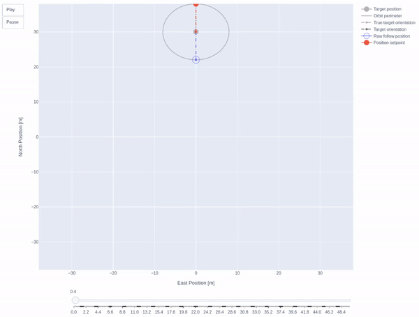
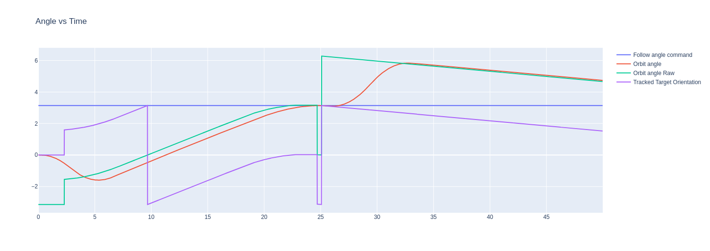

# Follow Target Algorithm Test Scripts

## Description
Scripts used for testing and visualizing different Follow Target behavior for the PX4-Autopilot PR.

PR Link : https://github.com/PX4/PX4-Autopilot/pull/19260

## Scripts

### 3_2nd_order_characteristics_test.ipynb
Reads in real flight data (.uLog) and applies 2nd order reference model filter with different natural frequency settings

Goal : Finding the right natural frequency value to generate a smooth-enough trajectory of the target

### 5_Follow_Me_behavior_simple_2D_animation.ipynb

* Demonstrates the Follow Me behavior of the Pull Request directly.
* Implements Jerk limited Orbit angle control & Adjustable follow angle setpoints

> Goal : Showcasing how the PR's Follow logic works

## uLog Files
1. FollowTarget_FullRate_2022-03-03_10-55-16.ulg
  * Includes Follow Target test log with follow_target_status uORB message logged in full rate
  * Used for 2nd order reference model natural frequency response graphing, since having high enough data point rate is important to get acurate approximation of in-flight filtering outputs
